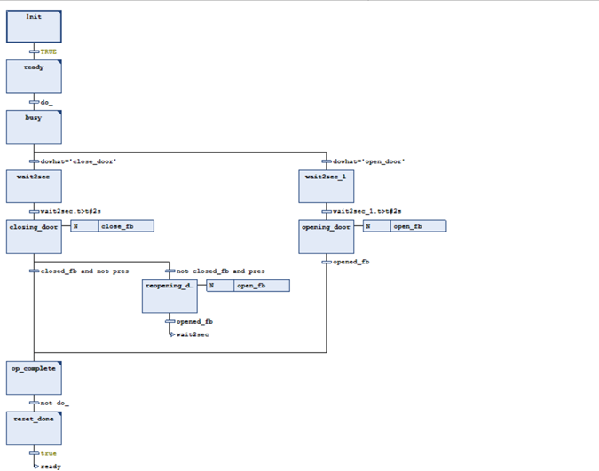

## Variables
```
FUNCTION_BLOCK Door_module
VAR_INPUT
	do_: BOOL;
	dowhat: STRING;
	pres: BOOL;
	closed_fb: BOOL;
	opened_fb: BOOL;
END_VAR
VAR_OUTPUT
	state: STRING;
	done: BOOL;
	close_fb: BOOL;
	open_fb: BOOL;
END_VAR
VAR
END_VAR
```
## Output Initialization  
```
Init:

done:=FALSE;
close_fb:=FALSE;
open_fb:=FALSE;

Ready:
state:='ready';

Busy:
state:=’busy';

op_complete:
done:=TRUE;

reset_done:
done:=FALSE;
```
## Scheme
