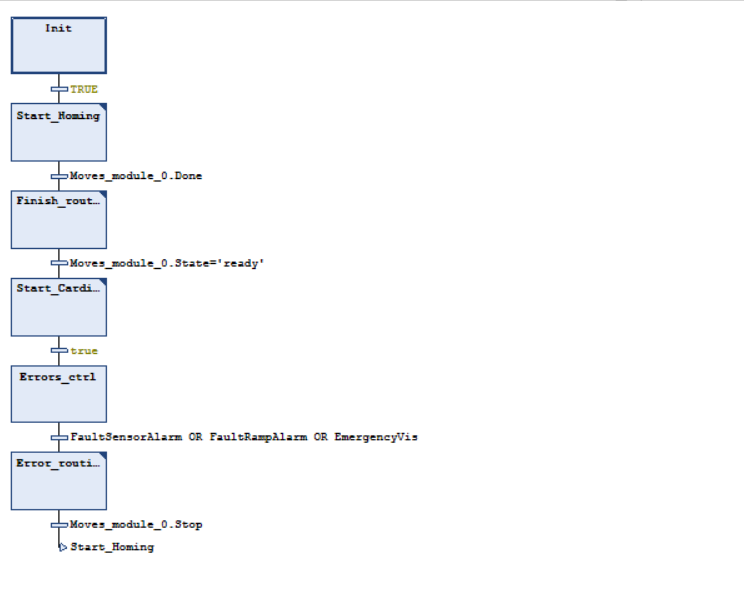

## Variables
```
PROGRAM Policy
VAR
	sync: BOOL;
	Opok: BOOL;
END_VAR	

```
## Start_Homing:
```
//CONTROLLO INIZIALE SULL'HOMING
IF NOT G_floor_problem THEN
	// START DELLA ROUTINE DI HOMING
	IF Moves_module_0.State='ready' THEN
		Moves_module_0.Start_:=TRUE;
		Moves_module_0.Stop:=FALSE;
		Moves_module_0.StartWhat:='homing';
	END_IF
ELSE
	// START DELLA ROUTINE DI EXCEPTION
	IF Moves_module_0.State='ready' THEN
		Moves_module_0.Start_:=TRUE;
		Moves_module_0.Stop:=FALSE;
		Moves_module_0.StartWhat:='exception';
	END_IF
END_IF
```
## Finish_routine:
```
// STOP STARTWHAT ROUTINE
IF Moves_module_0.State='busy' AND Moves_module_0.Done THEN
	Moves_module_0.Start_:=FALSE;
	Moves_module_0.Stop:=TRUE;
END_IF
```
## Start_Cardinal:
```
//START CARDINAL
IF Cardinal_0.State='ready' THEN
	Cardinal_0.Start_:=TRUE;
	Cardinal_0.Stop:=FALSE;
END_IF
//START MOVES_MODULE
IF Moves_module_0.State='ready' THEN
	Moves_module_0.Start_:=TRUE;
	Moves_module_0.Stop:=FALSE;
	Moves_module_0.StartWhat:='moves_module';
END_IF
```
## Error_routines:
```
// //STOP DI CARDINAL
// IF Cardinal_0.State='busy' THEN
// 	Cardinal_0.Start_:=FALSE;
// 	Cardinal_0.Stop:=TRUE;
// END_IF
//STOP DI MOVES_MODULE
IF Moves_module_0.State='busy' THEN
	Moves_module_0.Start_:=FALSE;
	Moves_module_0.Stop:=TRUE;
END_IF


```
## Scheme
